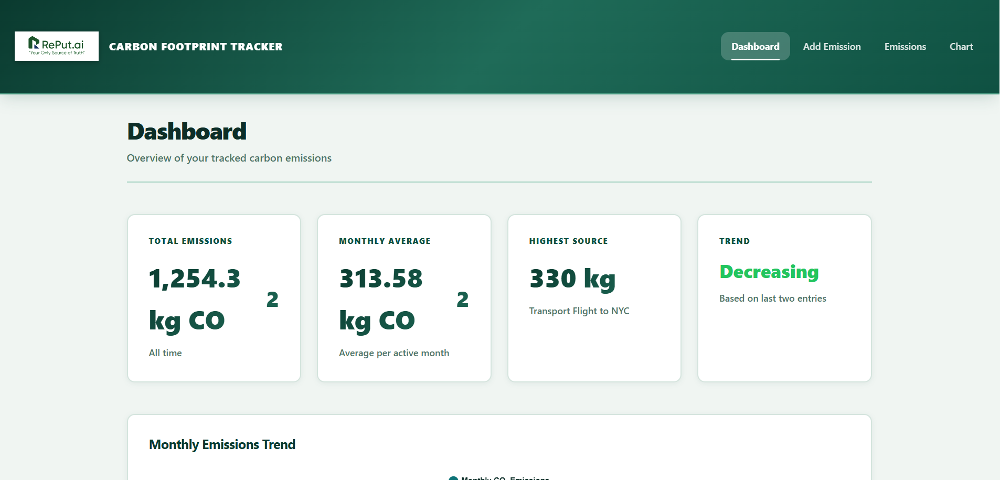

# Carbon Footprint Tracker

A professional Angular 18 application for tracking and analyzing personal carbon emissions.

**Live Demo**: https://carbon-footprint-sustainability.vercel.app/



---

## Setup Instructions

### Prerequisites
- Node.js (v18 or higher)
- npm (v9 or higher)
- Angular CLI 18.x

### Installation

1. **Clone the repository**
   ```bash
   git clone <repository-url>
   cd carbon-footprint-tracker
   ```

2. **Install dependencies**
   ```bash
   npm install
   ```

3. **Start the development server**
   ```bash
   ng serve
   ```
   Navigate to `http://localhost:4200/`. The application will automatically reload when you modify source files.

4. **Build for production**
   ```bash
   npm run build
   ```
   Build artifacts will be stored in the `dist/` directory.

5. **Run unit tests**
   ```bash
   npm test
   ```
   Tests are executed via Karma and Chrome headless browser.

---

## Features Implemented

1. **Dashboard** - KPI cards (total, monthly avg, highest source, trend), monthly chart, top 5 emissions list
2. **Add Emission Form** - Category, activity, amount, date, notes with real-time CO₂ calculation
3. **Emissions Table** - Sortable, filterable, searchable with edit/delete functionality
4. **Emissions Chart** - Monthly trend visualization using Chart.js
5. **Navigation** - Responsive header with hamburger menu for mobile
6. **State Management** - RxJS-based centralized state with localStorage persistence
7. **Mobile Responsive** - Works seamlessly on mobile, tablet, and desktop
8. **Additional Features** - Toast notifications, accessibility, SSR support

---

## Tech Stack
Angular 18, TypeScript, SCSS, RxJS, Chart.js, Angular Universal, Vercel

## Assumptions
- CO₂ conversion factors: Transport (0.15), Energy (0.4), Food (2.0), Waste (1.5) kg CO₂
- Data stored locally in browser (localStorage)
- No backend server or user authentication
- Responsive breakpoints: Mobile (<640px), Tablet (640-1024px), Desktop (>1024px)

## Time Spent: 10 hours


